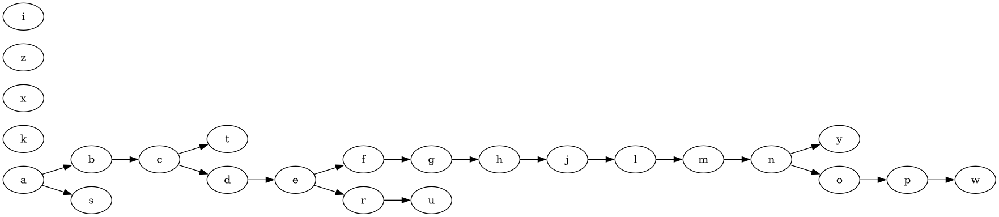
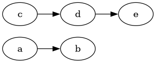

# Daily Coding Problem: Problem #1553 [Hard]

This has also appeared as problem 1203, and probably others.

## Problem Statement

This problem was asked by Airbnb.

You come across a dictionary of sorted words in a language you've never seen before.
Write a program that returns the correct order of letters in this language.

For example,
given `['xww', 'wxyz', 'wxyw', 'ywx', 'ywz']`,
you should return `['x', 'z', 'w', 'y']`.

## Analysis

The only way I can see to do this is to compare characters in adjacent pairs of words.
So compare characters in word 0 and word 1, characters in words 1 and 2, 2 and 3, etc.

If the first character of an adjacent pair of words is different,
`word[n][0]`  is lexically less than `word[n+m][0]`
Note that `n` is numerically less than `m`.
The initial letters of the sorted list of words have a "less than" relationship,
but there could be gaps.
Perhaps the unknown language only has words with some letters in the initial position.

If the first character of an adjacent pair of words is identical,
compare the second characters.
If the second characters differ, the first word's second character
is lexically less than the second word's second character.
if  the second characters are identical, compare third characters,
and so on.

You get one lexically less than relationship of characters
between any pair of adjacent words.
You can't assume an immediate, parent-child relationship.

You might also get letters where you can't determine a lexical less than relationship.
Consider a sorted list of words `['ab', 'ac', 'bae', 'bc']`.
You can tell that 'a' < 'b' when comparing "ac" and "bce",
but "bce" has an 'e' character that can't be compared to anything.
"bce" is the longest word in the sorted list.

Unless the sorted word list is chosen carefully,
you will at best get a [topological sort](https://www.johndcook.com/blog/2023/03/27/topological-sort/)
of the letters in the unknown language.

### Data Structures

The data structure to keep the characters in will need to allow arbitrary insertions,
but not deletions.
The trick here is that even when a pair of characters have a lexical relationship,
we don't know if characters will show up that are lexically between them.
We also have to pick a data structure that allows a "less than" character to have
multiple characters "greater than".

### Evolution of data structure

At first glance, I thought a doubly-linked list would work:

```
type node struct {
    character rune
    next *node
    prev *node
}
```
After thinking a bit and writing a little code,
I realized that a character could have multiple children
during the procedure of examining pairs of words,
even if after comparing all words, only one child character per character found existed.
A slice handles that situation.

```
type node struct {
    character rune
    children  []*node
}
```

I also realized that to insert a newly encountered letter,
I'd need to have a "parent" pointer.

```
type node struct {
    character rune
    parent    *node
    children  []*node
}
```

Then I realized a Go `map` type would be easier coding than
all the slice manipulation
required to make a node a child and remove child nodes.

```
type node struct {
    character rune
    parent    *node
    children  map[rune]*node
}
```

I keep a root node, the letter determined to be lexically least so far.
I wrongly believed that would be the first letter of the first word of the list.
That's not true, a word list of `['ba', 'bb', 'bc']` has a first letter
of first word that's not the first lexically sorted letter.

In addition, I have a `map[rune]*node` to track all of the characters discovered.
Due to Go's method system, I added a method through which all
per-character structures are obtained.

```
type nodePool map[rune]*node

func (p nodePool) characterNode(character rune) *node {
    if n, ok := p[character]; ok {
        return n
    }
    n := &node{ 
        character: character,
        children:  make(map[rune]*node),
    }
    p[character] = n
    return n
}
```

## Build and run

I developed this on a Linux machine, with go version go1.21.4 linux/amd64 compiler.

```
$ git clone https://github.com/bediger4000/alien_words.git
$ cd alien_words
$ go build $PWD
```

You will have an executable named `alien_words`.
It reads words from stdin or a file, one word per line.

```
$ ./alien_words in0  # this is the example given in problem statement
5 words in input
4 characters in language
first character x
        x has 1 children
x < z
        z has 1 children
z < w
        w has 1 children
w < y
        y has 0 children
```
This isn't exactly the output the problem statement requires,
but it's more informative.

I also added [GraphViz](https://graphviz.org) Dot-language output to
visualize more complicated results.

```
$ ./alien_words -g in2 > in2.dot
$ dot -Tpng -o in2.png in2.dot
```



That's an example of using 25 English language words,
chosen randomly from `/usr/share/dict/words`, file [in2](in2).

My program can't find any lexical less than relationship for 'i', 'z', 'x', 'k'.
'k' appears once in the file, at the end of "brock".
"bracero" sorts before "brock" in the list, and allows the program to deduce
that 'a' < 'o', but nothing else.
'z' appears in "bureaucratize" and "nasalizing", but again,
too far to the right in those words to allow a placement.
There's reasons for all these letters to appear without a parent.

It's also possible to create sorted lists of words that don't have a single
chain of lexical less than relationships.
Consider the list
`['abd', 'abe', 'bc', 'bd', 'be']`.

* a < b, based on "abe" sorting before "bc".
* d < e, based on "abd" sorting before "abe".
* c < d, d < e, based on "bc", "bd" and "be"

Nowhere can we find where 'c' relates to 'a' or 'b'.



The bash script [testit](testit) shows how to try different sized sorted lists
of English words.
It does use an executable [reservoir](https://github.com/bediger4000/reservoir-sampling)
to choose N words randomly from a file.
I find that even with 500 randomly chosen English words,
the program still can't always find where 'x', 'y' and 'z' sort.

## Interview Analysis

I think this is a decent interview question,
albeit not one that's good for whiteboard coding.

It requires the candidate to think about the problem,
and devise a solution.
The solution has some subtleties,
so the candidate will probably have to modify the data structure,
and change the algorithm as coding progresses and information presents itself.

The interviewer would get to see some non-trivial code.
There's opportunities for the candidate to make the code more or less clear
by choice of function and variable names,
and possibly by doing some small amount of object oriented coding.
Moving some code to methods can add clarity to the algorithm,
which is a little unusual in small problems like this.

The interviewer could also pose alternate word lists to get
candidates to consider corner cases.
This would allow an interviewer to see how a candidate refactors,
if the corner cases trigger bugs or break the algorithm.

I think any algorithm solving this problem would be hard to contain in a
candidate's head, requiring refactoring and changing code and data structures.
That's difficult on a whiteboard after even a small number of lines of code.
My code clocks in at just less than 200 lines,
which is certainly too big for a whiteboard.
